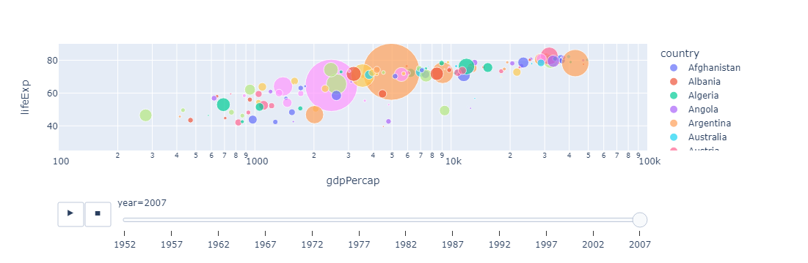

# Animated Scatter Plot

A scatter plot is one of the most useful ways to analyze the relationship between two features.
When you want to analyze how one feature in one dataset is affected by another feature, you probably need to use a scatter plot.

-----

## Code Break:

```python
# Import necessary libraries
import plotly.express as px
```

This line imports the `plotly.express` library.

```python
# Load the Gapminder dataset provided by plotly.express
data = px.data.gapminder()
```

`px.data.gapminder()` loads the Gapminder dataset into a pandas DataFrame.

```python
# Print the first few rows of the DataFrame
print(data.head())
```

This line prints the first few rows of the DataFrame to the console.

```python
# Create an animated scatter plot using plotly.express
px.scatter(
    data,
    x="gdpPercap",
    y="lifeExp",
    animation_frame="year",
    animation_group="country",
    size="pop",
    color="country",
    hover_name="country",
    log_x=True,
    size_max=55,
    range_x=[100, 100000],
    range_y=[25, 90],
)
```

The `px.scatter()` function is used to create an animated scatter plot. Here are the parameters used:

- `data`: The DataFrame containing the Gapminder dataset.
- `x` and `y`: The columns representing the x and y-axis data.
- `animation_frame`: The column that represents the animation over time (in this case, "year").
- `animation_group`: The column that groups the data for animation (in this case, "country").
- `size`: The column that determines the size of the markers (in this case, "pop" for population).
- `color`: The column that determines the color of the markers (in this case, "country").
- `hover_name`: The column to display when hovering over a data point (in this case, "country").
- `log_x`: Logarithmic scale for the x-axis (`True`).
- `size_max`: Maximum size of the markers.
- `range_x` and `range_y`: Define the range of values for the x and y-axes.

The resulting plot is an animated scatter plot that shows the relationship between GDP per capita (`gdpPercap`) and life expectancy (`lifeExp`) over different years, with each country represented by a marker. The size of the markers corresponds to the population (`pop`).

-----

## Output:



-----