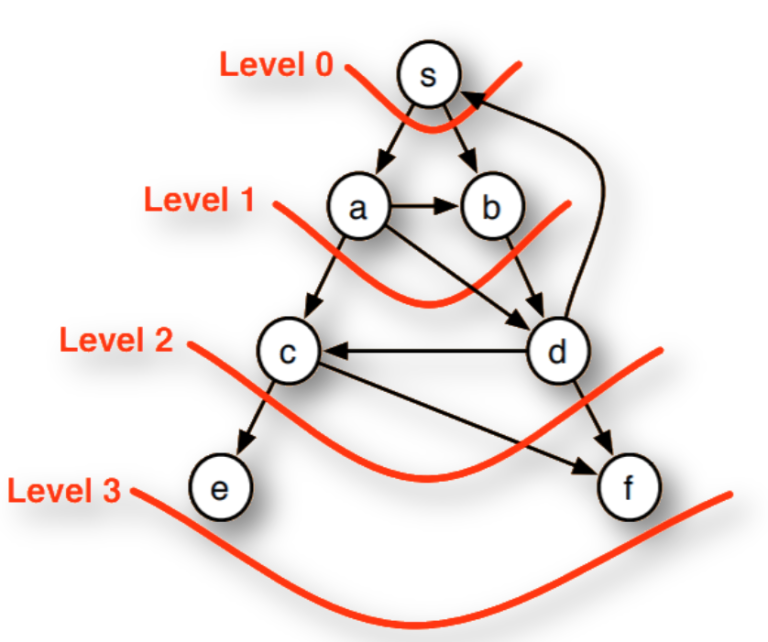

# Breadth-First Search

The Breadth-first search algorithm is a graph algorithm which is used to traverse a graph to find a particular node to ensure that we have visited all the nodes by crossing a layer at each step.

Breadth-First Search is a graph search algorithm that can be used to solve a variety of problems such as:

- finding all the vertices reachable from a vertex
- finding if an undirected graph is connected
- finding the shortest path from one vertex to all other vertices
- to determine if a graph is bipartite
- to bond the diameter of an undirected graph
- partitioning the graph



-----

## Code Break:

```python
def enqueue(queue, data):
    queue.append(data)
    return len(queue)
```

The `enqueue` function adds data to the end of a queue (implemented as a list) and returns the updated length of the queue.

```python
def dequeue(queue):
    try:
        return queue.pop(0)
    except IndexError as error:
        print(f"{error} is not possible")
```

The `dequeue` function removes and returns the element at the front of the queue (implemented as a list). It uses `pop(0)` to dequeue from the front. If the queue is empty, it catches the `IndexError` and prints an error message.

```python
def breadth_first(graph, root):
    queue = []
    visited_nodes = []
    queue.append(root)
    visited_nodes.append(root)
    current_node = root

    while len(queue) > 0:
        current_node = dequeue(queue)
        adj_nodes = graph[current_node]
        remaining_elements = sorted(set(adj_nodes) - set(visited_nodes))

        if len(remaining_elements) > 0:
            for element in remaining_elements:
                visited_nodes.append(element)
                enqueue(queue, element)

    return visited_nodes
```

The `breadth_first` function performs breadth-first traversal on a graph represented as an adjacency list (`graph`). It uses a queue to keep track of nodes to visit next. It initializes with the `root` node and iterates through the graph, enqueueing adjacent nodes and marking them as visited.

```python
# Example usage:
graph = dict()

graph["A"] = ["B", "G", "D"]
graph["B"] = ["A", "F", "E"]
graph["C"] = ["F", "H"]
graph["D"] = ["F", "A"]
graph["E"] = ["B", "G"]
graph["F"] = ["B", "D", "C"]
graph["G"] = ["A", "E"]
graph["H"] = ["C"]

result = breadth_first(graph, "A")
print(result)
```

An example graph is provided, and the `breadth_first` function is called with the starting node "A". The result, which is the list of visited nodes in breadth-first order, is then printed. The output might be `['A', 'B', 'G', 'D', 'F', 'E', 'C', 'H']`.

-----