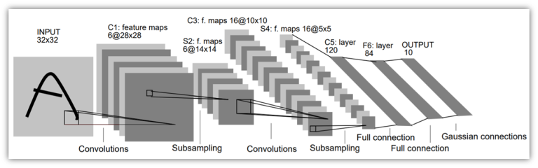
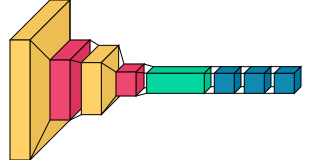

# LeNet-5 Architecture

The LeNet-5 architecture is the most widely used architecture of convolutional neural networks. It was created by Yann LeCunn in 1998. It includes 7 layers, excluding the input layer, which contains the trainable parameters called weights.



In the neural network architecture shown above:

- Layer C1 is a convolutional layer with six feature maps where the size of the feature maps is 28×28;
- Layer S2 is a sub-sampling layer with six feature maps where the size of the feature maps is 14×14;
- Layer C3 is a convolutional layer with sixteen feature maps where the size of the feature maps is 10×10;
- Layer S4 is s sub-sampling layer with sixteen feature maps where the size of feature maps is 5×5;
- Layer C5 is a convolutional layer with 120 feature maps where the size of the feature maps is 1×1;
- Layer F6 contains 84 units and is fully connected to the C5 convolutional layer.

-----

## Installation

```
pip install visualkeras tensorflow keras
```
Firstly import the `visualkeras tensorflow keras` libraries through the terminal that will help in the program.

-----

## Code Break:

```python
import keras
from tensorflow import keras
import keras.layers as layers
from keras.models import Sequential, Input, Model
from keras.layers import Dense, Dropout, Flatten
from keras.layers import Conv2D, MaxPooling2D
from keras.layers.advanced_activations import LeakyReLU
import tensorflow as tf
```
These lines import the necessary libraries and modules for building a Convolutional Neural Network (CNN) using Keras and TensorFlow.

```python
model = keras.Sequential()
```
This initializes a sequential model, which is a linear stack of layers.

```python
model.add(
    layers.Conv2D(
        filters=6, kernel_size=(3, 3), activation="relu", input_shape=(32, 32, 1)
    )
)
```
This adds the first convolutional layer with 6 filters, a kernel size of (3, 3), ReLU activation, and an input shape of (32, 32, 1).

```python
model.add(layers.AveragePooling2D())
```
This adds an average pooling layer.

```python
model.add(layers.Conv2D(filters=16, kernel_size=(3, 3), activation="relu"))
```
This adds the second convolutional layer with 16 filters, a kernel size of (3, 3), and ReLU activation.

```python
model.add(layers.AveragePooling2D())
```
This adds another average pooling layer.

```python
model.add(layers.Flatten())
```
This flattens the output from the previous layer.

```python
model.add(layers.Dense(units=120, activation="relu"))
model.add(layers.Dense(units=84, activation="relu"))
```
These lines add two dense (fully connected) layers with 120 and 84 units, respectively, both using ReLU activation.

```python
model.add(layers.Dense(units=10, activation="softmax"))
```
This adds the final dense layer with 10 units (for classification) and softmax activation.

```python
model.compile(
    loss=keras.losses.categorical_crossentropy,
    optimizer=keras.optimizers.Adam(),
    metrics=["accuracy"],
)
```
This compiles the model, specifying the loss function, optimizer, and evaluation metric.

```python
import visualkeras
visualkeras.layered_view(model)
```
This uses the `visualkeras` library to generate a visual representation of the model's architecture, providing a layered view. This can be helpful for understanding the structure of the neural network.

-----

## Output:

