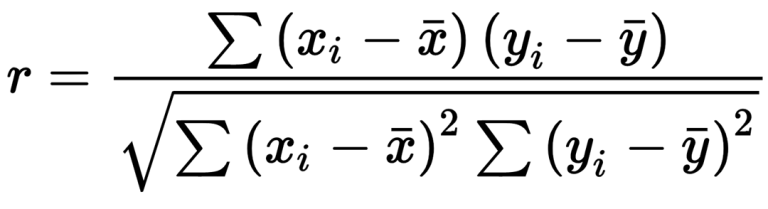

# Pearson Correlation

When two or more features are related to each other in such a way that if the value of 1 features increases, the value of the other feature also increases or decreases. This is what correlation means.
The degree of correlation is between -1 and 1.

-----

## Formula:



Where: 

r - correlation coefficient
\( x_i \) - values of the x-variable in a sample
\( \bar{x} \) - mean of the values of the x-variable
\( y_i \) - values of the y-variable in a sample
\( \bar{y} \) - mean of the values of the y-variable

-----

## Code Break:

```python
import pandas as pd
import seaborn as sns
import matplotlib.pyplot as plt
```

These lines import the necessary libraries: Pandas for data manipulation, Seaborn for statistical data visualization, and Matplotlib for creating plots.

```python
movies = pd.read_csv("<your csv file>")
```

This line reads a CSV file into a Pandas DataFrame. Replace `"<your csv file>"` with the actual path or URL of your CSV file.

```python
movies["Rotten Tomatoes"] = movies["Rotten Tomatoes"].str.replace("%", "").astype(float)
```

This line removes the "%" sign from the "Rotten Tomatoes" column and converts the values to float, making them suitable for correlation analysis.

```python
movies.drop("Type", inplace=True, axis=1)
```

This line drops the "Type" column from the DataFrame as it might not be relevant for correlation analysis.

```python
correlations = movies.corr(method="pearson")
```

This line calculates the Pearson correlation coefficients between different features in the dataset. The resulting correlations DataFrame is stored in the variable `correlations`.

```python
# Correlation Between All The Features
print(correlations)
```

This line prints the correlation matrix, showing the correlation coefficients between all pairs of features in the dataset.

```python
# Correlation Between A Particular column "Year"
print(correlations["Year"])
```

This line prints the correlation coefficients between the "Year" column and all other columns in the dataset.

```python
# Visualizing Correlation
sns.heatmap(correlations)
plt.show()
```

These lines use Seaborn to create a heatmap visualizing the correlation matrix. The resulting plot is displayed using Matplotlib's `plt.show()`.

Remember to replace `"<your csv file>"` with the actual path or URL of your CSV file for the script to work correctly. Additionally, make sure your dataset has a "Year" column for the correlation analysis to include it.

-----