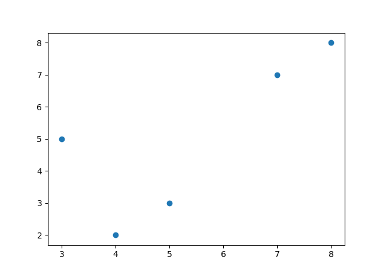
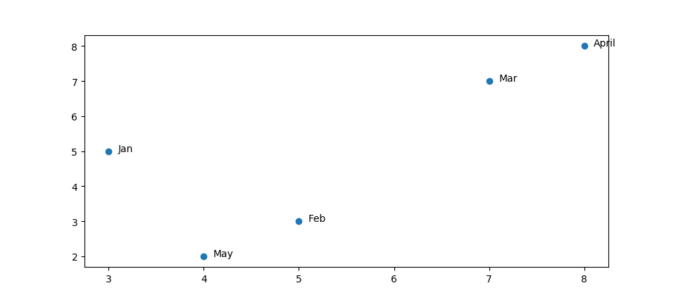

# Plotting Annotations

Plotting annotations while viewing graphs is considered a good practice because it makes your graphs self-explanatory.
Plotting annotations while visualizing your data is considered good practice to make the graphs self-explanatory.


-----

# Code Break:

```python
# without annotations
import matplotlib.pyplot as plt

x = [3, 5, 7, 8, 4]
y = [5, 3, 7, 8, 2]

plt.scatter(x, y)
plt.show()
```

The first part of the code generates a scatter plot without annotations. It uses the `scatter` function from `matplotlib.pyplot` to create a scatter plot with points at coordinates specified by the lists `x` and `y`. The `show` function is then called to display the plot.

```python
# with annotations
x = [3, 5, 7, 8, 4]
y = [5, 3, 7, 8, 2]

labels = ["Jan", "Feb", "Mar", "April", "May"]
plt.scatter(x, y)

for i, j in enumerate(labels):
    plt.annotate(j, (x[i] + 0.10, y[i]), fontsize=10)

plt.show()
```

The second part of the code enhances the previous scatter plot by adding annotations. It introduces a list of labels (`labels`) corresponding to each point. The `enumerate` function is used in the loop to iterate through both the labels and the coordinates simultaneously. The `annotate` function is then called to display each label next to its corresponding point. The `fontsize` parameter is set to 10 to adjust the font size of the annotations. Finally, the `show` function is called to display the updated scatter plot with annotations.

-----

## Outputs

> without annotations


> with annotations


-----