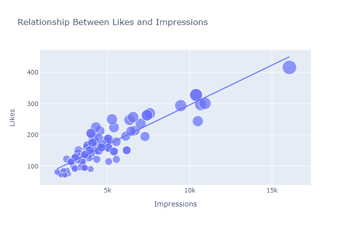
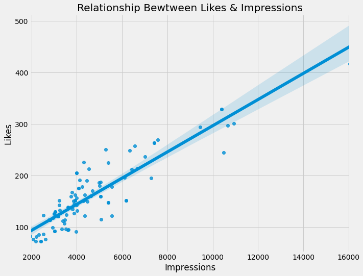

# Visualize Linear Relationship

A linear relationship is a statistical term that is nothing but the relationship between two variables. A linear relationship shows how well two variables x and y are related to each other.

This Python script uses various libraries like `pandas`, `numpy`, `plotly.express`, `matplotlib`, and `seaborn` to visualize the relationship between likes and impressions using a scatter plot with a regression line.

-----

## Installation

```
pip install pandas
```
```
pip install numpy
```
```
pip install plotly
```
```
pip install matplotlib
```
```
pip install seaborn
```
```
pip install statsmodels
```
Firstly import these libraries through the terminal that will help in the program.

-----

## Code Break:

```python
# Import necessary libraries
import pandas as pd
import numpy as np
import plotly.express as px
import matplotlib.pyplot as plt
import seaborn as sns
```

These lines import the required libraries (`pandas`, `numpy`, `plotly.express`, `matplotlib`, and `seaborn`).

```python
# Read the CSV data from the provided URL into a pandas DataFrame
data = pd.read_csv(
    "https://raw.githubusercontent.com/amankharwal/Website-data/master/Instagram.csv",
    encoding="latin1",
)
```

The `pd.read_csv()` function is used to read the data from a CSV file hosted at the specified URL. The data is loaded into a pandas DataFrame named `data`.

```python
# Drop rows with missing values
data = data.dropna()
```

The `dropna()` method is used to remove rows with missing values (NaN) from the DataFrame.

```python
# Create a scatter plot with a regression line using plotly.express
figure = px.scatter(
    data_frame=data,
    x="Impressions",
    y="Likes",
    size="Likes",
    trendline="ols",
    title="Relationship Between Likes and Impressions",
)
figure.show()
```

`plotly.express` is used to create an interactive scatter plot. The x-axis represents "Impressions," the y-axis represents "Likes," and the size of the markers is based on the number of "Likes." Additionally, a trendline using ordinary least squares (OLS) regression is added to the plot.

```python
# Create a seaborn regression plot
plt.figure(figsize=(10, 8))
plt.style.use("fivethirtyeight")
plt.title("Relationship Between Likes & Impressions")
sns.regplot(x="Impressions", y="Likes", data=data)
plt.show()
```

Here, `seaborn` is used to create a traditional regression plot. The `regplot()` function is used to display the relationship between "Impressions" and "Likes" with a regression line. `plt.show()` is then used to display the plot. The `plt.style.use("fivethirtyeight")` sets the style of the plot to a specific theme.

-----

## Output




-----