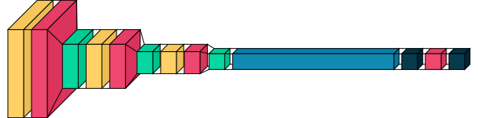

# Visualize a Neural Network

There are many tools you can use for visualizing the architecture of a neural network. Some of the best tools for visualizing a neural network are:

- Net2Vis
- VisualKeras
- drawconvent
- NNSVG
- PlotNeuralNet
- Tensorboard
- Graphviz
- TensorSpace

-----

## Installation

```
pip install keras matplotlib plotly tenserflow visualkeras
```
Firstly import the `keras matplotlib plotly tenserflow visualkeras` libraries through the terminal that will help in the program.

-----

## Code Break:

```python
import keras  # Import the Keras library
from matplotlib.pyplot import title  # Import the 'title' function from the 'matplotlib.pyplot' module
from keras.models import Sequential, Input, Model  # Import necessary components for building a Sequential model
from keras.layers import Dense, Dropout, Flatten  # Import dense, dropout, and flatten layers
from keras.layers import Conv2D, MaxPooling2D  # Import 2D convolution and max-pooling layers
from keras.layers.advanced_activations import LeakyReLU  # Import the Leaky ReLU activation function
import tensorflow as tf  # Import the TensorFlow library
from tensorflow import keras  # Import the 'keras' module from TensorFlow
import visualkeras  # Import the 'visualkeras' library for visualizing Keras models

model = Sequential()  # Create a sequential model
model.add(
    Conv2D(
        32,
        kernel_size=(3, 3),
        activation="linear",
        input_shape=(28, 28, 1),
        padding="same",
    )
)
```

Here, a Sequential model is created, and a convolutional layer is added with 32 filters, a kernel size of (3, 3), linear activation function, input shape of (28, 28, 1), and same padding.

```python
model.add(LeakyReLU(alpha=0.1))  # Add Leaky ReLU activation layer with alpha parameter
model.add(MaxPooling2D((2, 2), padding="same"))  # Add max-pooling layer with pool size (2, 2) and same padding
model.add(Conv2D(64, (3, 3), activation="linear", padding="same"))  # Add another convolutional layer
model.add(LeakyReLU(alpha=0.1))  # Add Leaky ReLU activation layer
model.add(MaxPooling2D(pool_size=(2, 2), padding="same"))  # Add another max-pooling layer
model.add(Conv2D(128, (3, 3), activation="linear", padding="same"))  # Add another convolutional layer
model.add(LeakyReLU(alpha=0.1))  # Add Leaky ReLU activation layer
model.add(MaxPooling2D(pool_size=(2, 2), padding="same"))  # Add another max-pooling layer
model.add(Flatten())  # Flatten the output for dense layers
model.add(Dense(128, activation="linear"))  # Add a dense layer with linear activation
model.add(LeakyReLU(alpha=0.1))  # Add Leaky ReLU activation layer
model.add(Dense(500, activation="softmax"))  # Add another dense layer with softmax activation
model.compile(
    loss=keras.losses.categorical_crossentropy,
    optimizer=keras.optimizers.Adam(),
    metrics=["accuracy"],
)
```

These lines add Leaky ReLU, max-pooling, convolutional, and dense layers to the model. The model is compiled using categorical crossentropy loss, Adam optimizer, and accuracy as a metric.

```python
visualkeras.layered_view(model)  # Visualize the layered view of the model using visualkeras
```

Finally, the model's architecture is visualized using the visualkeras library.

-----

## Ouput



-----